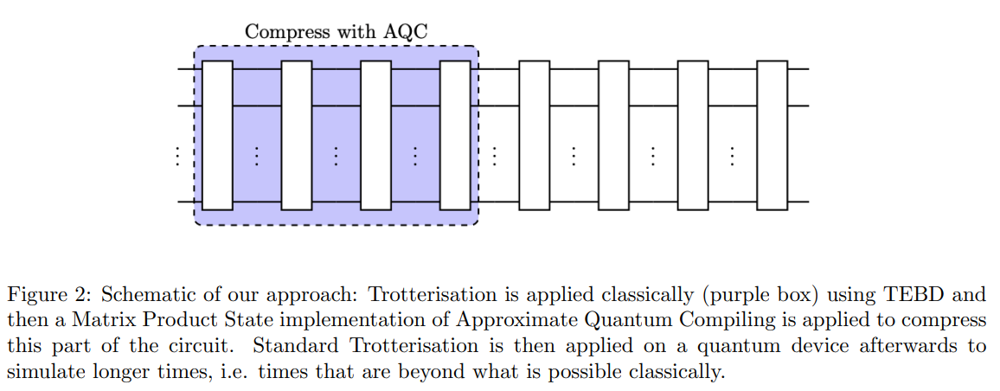

# AQC-Tensor Qiskit addon

This addon enables a Qiskit user to perform approximate quantum compilation using tensor networks,
a technique that was introduced in [arXiv:2301.08609](https://arxiv.org/abs/2301.08609).

Specifically, this package allows one to compile the _initial portion_ of a circuit into a nearly equivalent approximation of that circuit, but with much fewer layers.

It has been tested primarily on Trotter circuits to date.  It may, however, be applicable to any class of circuits where one has access to both:

1. A _great_ intermediate state, known as the "target state," that can be achieved by tensor-network simulation; and,
2. A _good_ circuit that prepares an approximation to the target state, but with fewer layers when compiled to the target hardware device.

(Figure is taken from [arXiv:2301.08609](https://arxiv.org/abs/2301.08609).)
