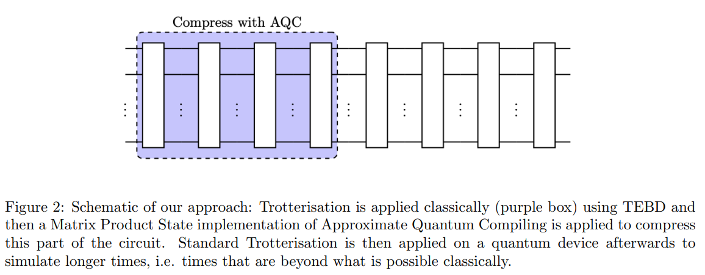

#################################################################
Approximate quantum compilation with tensor networks (AQC-Tensor)
#################################################################

With the AQC-Tensor addon, you can perform approximate quantum compilation by using tensor networks,
a technique that was introduced in `arXiv:2301.08609 <https://arxiv.org/abs/2301.08609>`__.

Specifically, with this package you can compile the *initial portion* of a circuit into a nearly equivalent approximation of that circuit, but with fewer layers.

It has been tested primarily on Trotter circuits to date.  It might, however, be applicable to any class of circuits where you have access to both of the following:

- A *great* intermediate state, known as the "target state", that can be achieved by tensor-network simulation
- A *good* circuit that prepares an approximation to the target state, but with fewer layers when compiled to the target hardware device

(Figure is taken from `arXiv:2301.08609 <https://arxiv.org/abs/2301.08609>`__.)

Developer guide
---------------

The developer guide is located at `CONTRIBUTING.md <https://github.com/Qiskit/qiskit-addon-aqc-tensor/blob/main/CONTRIBUTING.md>`__ in the root of this project's repository.

Citing this project
-------------------

If you use this package in your research, use the ``CITATON.bib`` file in this project's repository to cite the appropriate references:

.. literalinclude:: ../CITATION.bib
   :language: bibtex

Contents
--------
.. toctree::
  :hidden:

   Documentation Home <self>
   Installation Instructions <install>
   Tutorials <tutorials/index>
   Explanatory Material <explanation/index>
   API Reference <apidocs/index>
   How-To Guides <how-tos/index>
   GitHub <https://github.com/Qiskit/qiskit-addon-aqc-tensor>
   Release Notes <release-notes>